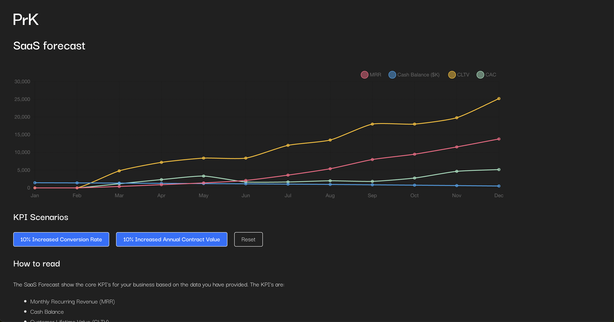

# PrK Equity

PrK Equity is a mock platform for a fictional private equity company.



## What's inside

Right now it's only a dashboard page with a chart. The intention is to show common SaaS metrics and allow some kind of customization to explore effects on the business in different scenarios.

The data for the metrics is taken from [Creandums Financial plan model template](https://blog.creandum.com/financial-plan-model-template-creandum-f28622951028). Highly recommend to check it out if you are interested in that kind of stuff.

## Philosophy

Main philosophy has been to keep it simple. The goals is to visualizes data in a performant, responsive, and preferably beautiful way. The possibility to interact with the data hopefully makes it a bit more interesting to the user of the website.

As few dependencies as possible. Responsive be default, at least possible to view the chart in a mobile.

In the base case there where two components, one is the server, which you shouldn't have to do anything with, and the other one is the client. The client a [Vite](https://vitejs.dev/) project.

The server is not used at the moment. The intention with the server is to retrieve data. Might add later.
The server has two endpoints, `/ads-spend-data` and `/purchase-data`, which queries BigQuery and returns some data.

Test are not included.

## Pre-requisites

Latest Node LTS version.

## Getting Started

Clone repo.

Open a terminal window and run one command in each:

```bash
yarn dev
```
